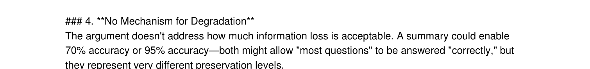
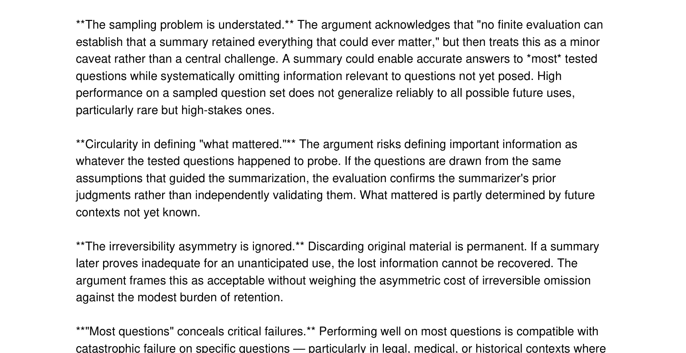
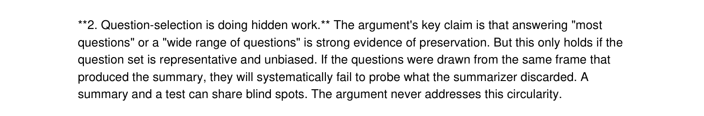
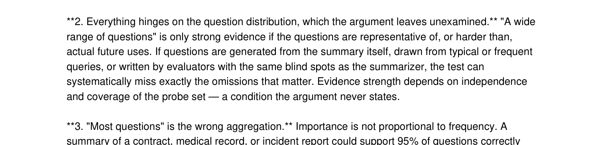
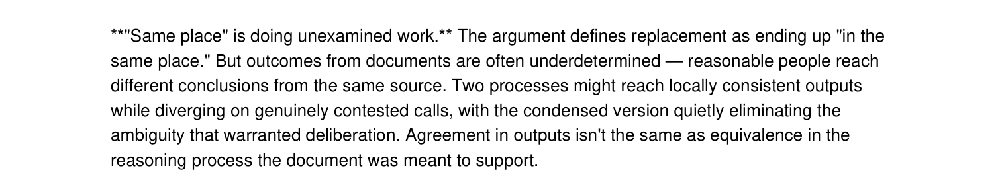
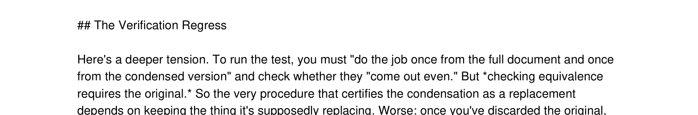
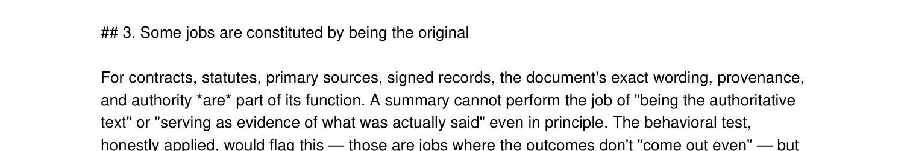
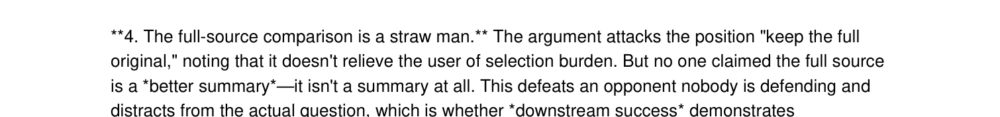
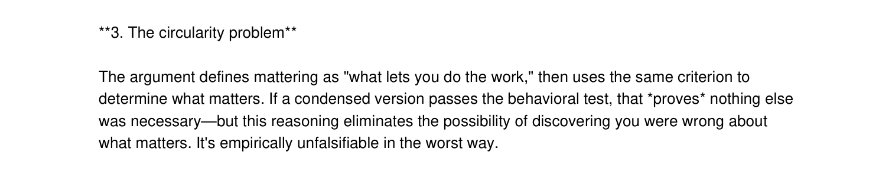
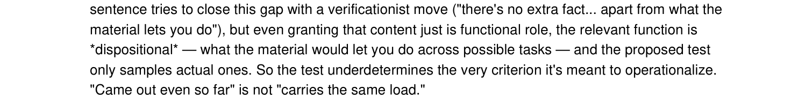

# Conceptual Critique Eval — Figure Placement

Screenshots of model critiques, grouped by report section. Each figure is preceded by the sentence it should follow in the draft and annotated with its caption. Regenerate images with `python3 make_figures.py`.

## Q0 baseline and critique leakage

> Insert after: “Haiku often focused on clearer thresholds, broader coverage, and how much accuracy should count as enough.”

***Figure 1.*** Haiku shifts toward threshold-setting and operational detail rather than identifying a deeper conceptual flaw. *(Haiku, Q0, sample 1.)*

> Insert after: “All four model families found some version of those points.”

***Figure 2.*** Sonnet identifies the expected sampling and rare-omission critique that Q0 strongly cued. *(Sonnet, Q0, sample 1.)*

## Q0 polished restatement

> Insert after: “Opus and Fable produced broader critiques, but some initially seemed better than they were because they restated premises already present in the argument using more polished language.”

***Figure 3.*** Opus gives a polished formulation of the question-distribution concern. *(Opus, Q0, sample 2.)*

## Laundry-list critique

> Insert after: “Longer responses accumulated many plausible objections but often did not decide which one was central.”

***Figure 4.*** Fable lists several overlapping critique categories without clearly ranking the load-bearing flaw. *(Fable, Q0, sample 0.)*

## Q1 argument-specific critiques

> Insert after: “Sonnet questioned whether reaching the same output means the reasoning process was preserved.”

***Figure 5.*** Sonnet challenges whether matching outputs implies equivalent reasoning. *(Sonnet, Q1, sample 2.)*

> Insert after: “Opus pointed out that verifying whether the summary is faithful is itself a task that still requires the original.”

***Figure 6.*** Opus identifies verification as a function the original still performs. *(Opus, Q1, sample 0.)*

> Insert after: “Fable identified the clearest new counterexample: some documents matter because they are the original.”

***Figure 7.*** Fable notes that authoritative or evidential status may not transfer to a summary. *(Fable, Q1, sample 1.)*

## Weak novelty detection and overclaiming

> Insert after: “It also sometimes overstated objections with labels such as “circular,” “unfalsifiable,” or “straw man,” even when the underlying issue was weaker or repairable.”

***Figure 8.*** Opus overstates the full-source paragraph as a straw man. *(Opus, Q0, sample 2.)*

> Insert after: “It also sometimes overstated objections with labels such as “circular,” “unfalsifiable,” or “straw man,” even when the underlying issue was weaker or repairable.”

***Figure 9.*** Haiku calls the criterion unfalsifiable even though it remains testable over a specified task set. *(Haiku, Q1, sample 2.)*

## Q0/Q1 polished restatement

> Insert after: “The argument already acknowledged that relevance is task-relative, finite evaluation cannot guarantee complete preservation, and downstream performance is evidence rather than proof.”

***Figure 10.*** Fable sharpens the observed-versus-possible-tasks distinction, but much of the premise was already acknowledged. *(Fable, Q1, sample 1.)*
